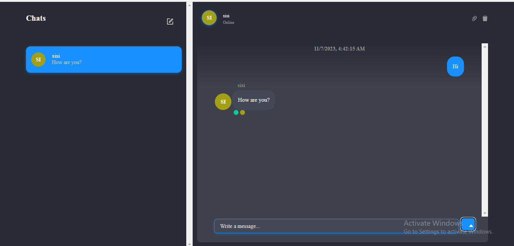
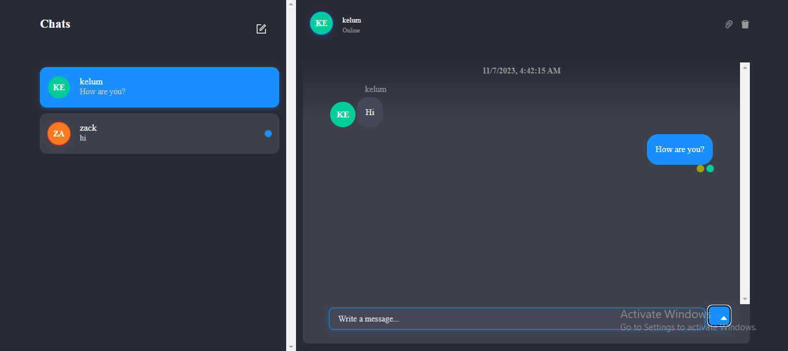

# A Realtime chat app

## Features:

* User Authentication
* Socket connections
* Realtime messaging
* Image and file attachments
* Group chats and DMs
* Read and receipts

## Backend

* NodeJS
* ExpressJS
* ChatEngine.io 

## Frontend

* ReactJS
* Chat Engine's npm components

The following diagram shows how the UI of chat App.

  
  

